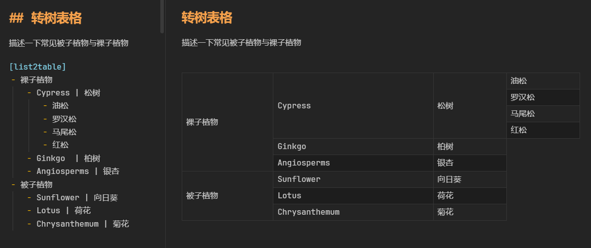
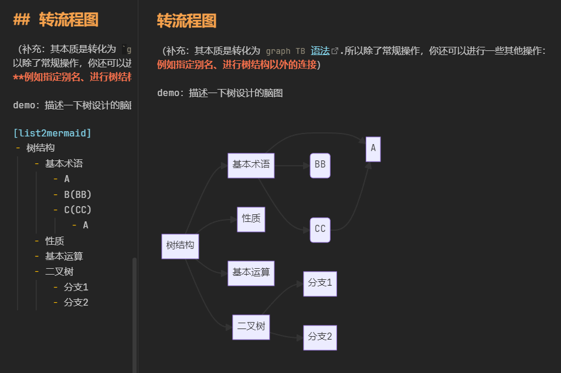
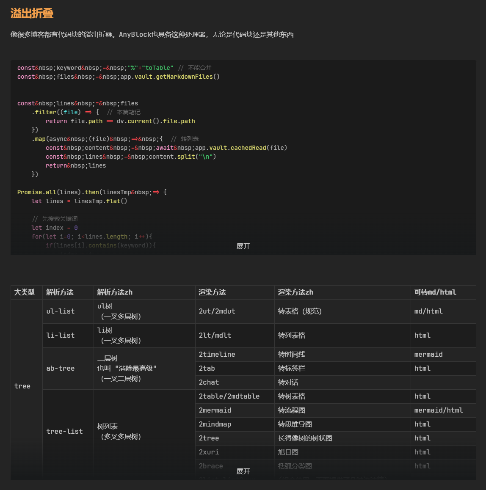
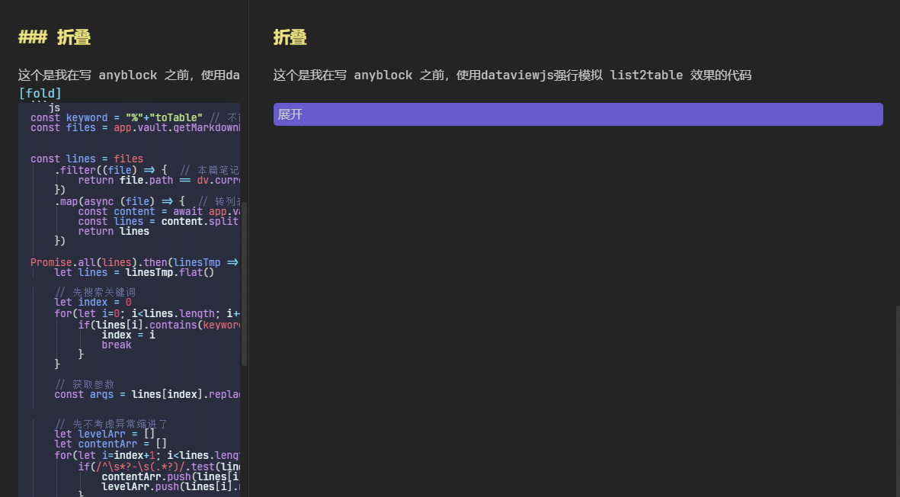
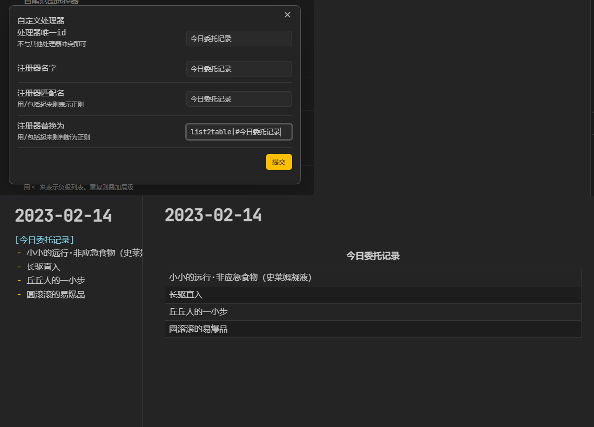

# README

This is a **【no new syntax, non-intrusive, extensible】** Markdown block extension rendering plugin

（这是一个 **【无需新语法、无入侵式、可扩展】** 的 Markdown 块扩展渲染插件）

### Multi-Language (多语言)

- en
	- Language issues: Documentation is multilingual (en /en), don't worry
	- Alternate site links：When the website link to this article fails, try replacing `linczero.github.io` with `linczero-github-io.pages.dev` in the url
- zh
	- 语言问题：文档是多语言的（zh/en），不用担心
	- 备用网站链接：如果网站失效，则将网站链接部分的 `linczero.github.io` 替换成 `linczero-github-io.pages.dev` 就可以了
	  （**本文的默认网站链接指向 github.io，如果国内有不能访问的朋友，那么大概率需要做这一步**）

### More Links (相关链接)

- en
	- Related links：tutorial、use skill、contribution、secondary development
	- [Online Wiki - github.io](https://linczero.github.io/MdNote_Public/ProductDoc/AnyBlock/)
	- [Online Effects warrior - github.io](https://linczero.github.io/MdNote_Public/ProductDoc/AnyBlock/README.show.md)
- zh
	- 相关链接：教程、使用技能、贡献、二次开发
	- [在线文档 - github.io](https://linczero.github.io/MdNote_Public/ProductDoc/AnyBlock/)
	- [在线效果展示 - github.io](https://linczero.github.io/MdNote_Public/ProductDoc/AnyBlock/README.show.md)

## Effects warrior (效果展示)

`multiWay table`/`multiCross table`/`Cross table` (`多叉表格`/`跨行表格`)

`ListTable`/`TreeTable`/`TreeGrid` (`列表格`/`树型表格`)

Dir Tree (目录树)

ASCII Dir Tree (ascii 目录树) 

  WBS (Work Breakdown Structure, 工作分解结构)

timeline (时间线)

mermaid flow (mermaid流程图)

plantuml mindmap (plantuml 思维导图)

markmap mindmap (markmap 思维导图)

mermaid mindmap (mermaid 思维导图)

[more……](https://linczero.github.io/MdNote_Public/%E4%BA%A7%E5%93%81%E6%96%87%E6%A1%A3/AnyBlock/)

## Effects warrior - old (旧效果展示)

Here are some of the more common processors:
- list2table  (2datatable)
- list2listtable
- list2mermaid  (graph LR)
- list2mindmap  (mermaid v9.3.0 mindmap)
- list2tab
- list2timeline
- title2list + list2somthing

 

 

 

