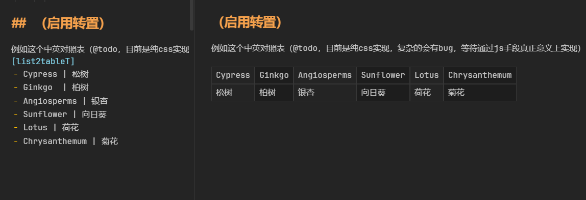
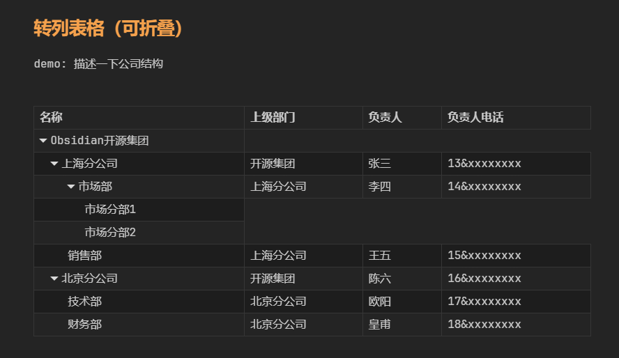
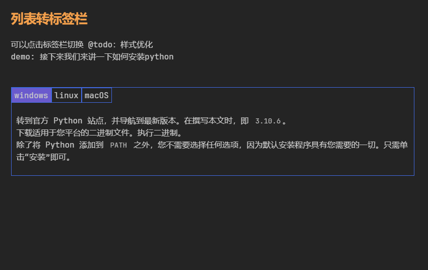
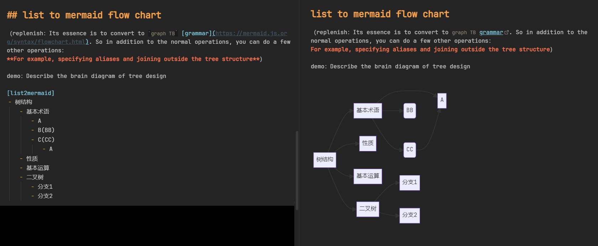
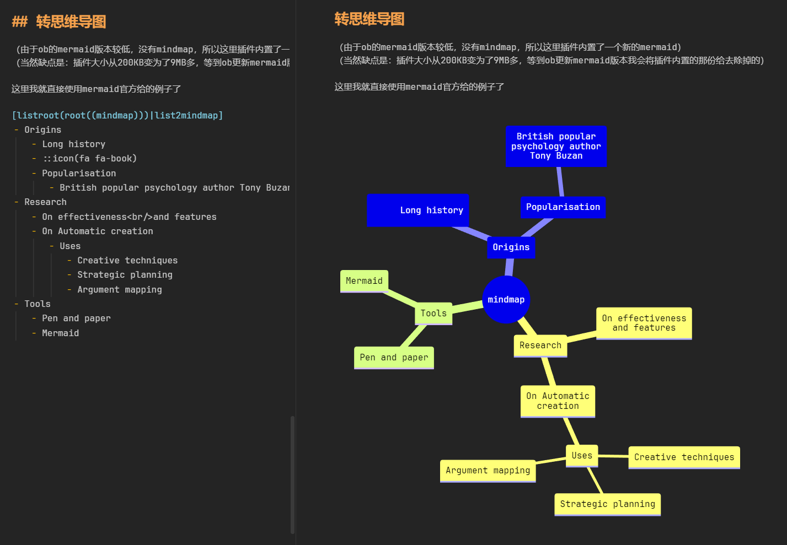
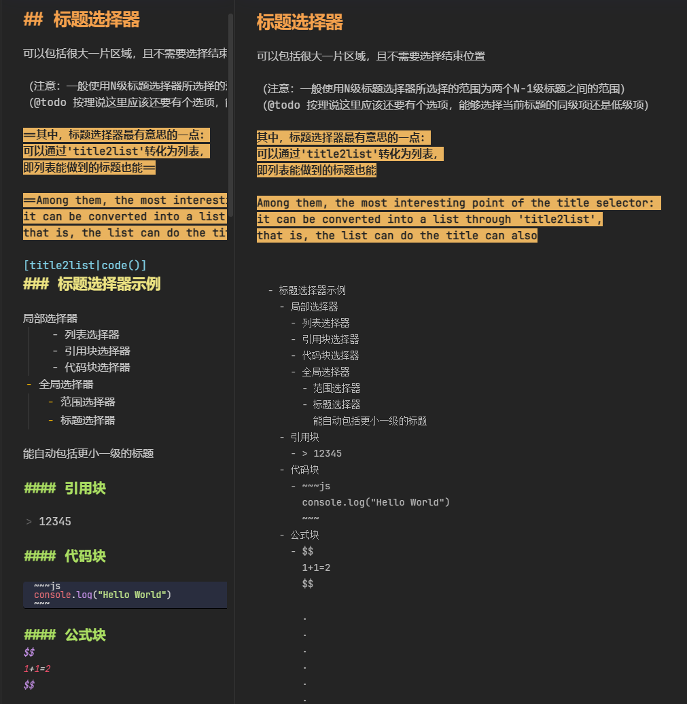

中文 | [英语](README.md)

# obsidian-any-block

A Obsidian Plugin. You can flexibility to create a 'Block' by some means.
 
## Usage

Function：Block conversion、list to table or other tree graph，See the `demo` sample folder for details

[Usage Tutorial & Sample Library](./demo)

## If bug

try to close `strict line wrapping`

## Suport command

Look the setup panel or [Usage Tutorial & Sample Library](./demo)

说其中一些比较常用的处理器：
- 列表转表格
- 列表转列表格
- 列表转流程图
- 列表转思维导图
- 列表转标签栏
- 列表转时间线
- 标题转列表从而转其他（can use title2list processor）

## Update log

- v1.3.0
	- 用户层面的修改不多，但对代码处理器部分**重构了一遍**，以便后续的开发
		- 使用了SVELTE框架辅助开发
		- 扩展了处理器接口，能够接受更多种类的处理器、且处理器的组合会更加多样
	- 提供了处理器的简单自定义（通过设置面板设置 `别名` 的方式）
	- 提供了众多新的处理器，与新的处理器类型——装饰处理器
		- 标题& 黑幕& 折叠& 滚动& 动态增加class
- v1.3.0 之前
	- 不记录，详见commits
	- 增加了标题选择器

## support

开发不易，赞助入口（可备注：OB插件support）

## Todo

**(Don't repet it in issue)**

- reinforce
	- 选择器
		- **嵌套选择器**
		  没有嵌套的程序是没有灵魂的 !!!
		  （但问题在于，例如说第一层是tree，可能会破坏结构，有歧义。因为现在的tree格式是number-str的，那需要number-dom才行）
		  （或者说：列表选择器不能嵌套列表选择器有歧义，需要嵌套引用选择器，在此基础上你解除引用选择器间接嵌套）
	- 处理器
		- QA处理器
		- 优化2ultable，在这个模式中让内联换行变成同级换行而非下级换行的意思
	- 层级
		- 负级列表开关
		- 根据层级关系，推荐合理的处理器（如检测到树相关的就推荐树类处理器）
	- 样式
		- 树表格的间隔着色样式获取可以优化
		  方案1：例如多行的格可以视情况使用渐变（单数不用，复数需要，但会不会有不统一的问题）？
		  方案2：仿mindmap的着色，后面的列就不要隔行着色了
	- 转化
		- 右键选择转化为：md原生(表格)/html格式/图片
- fixing bug
	- 复选框列表的兼容、有序列表的兼容
	- **引用块内的列表/列表内的引用块 无法识别**
	- **表格转置与表头符号冲突、转置模式目前是纯css实现的 如果大家的行高不相同，会出现不匹配的情况。**
	  后续会将css实现改进为转化table元素实现
