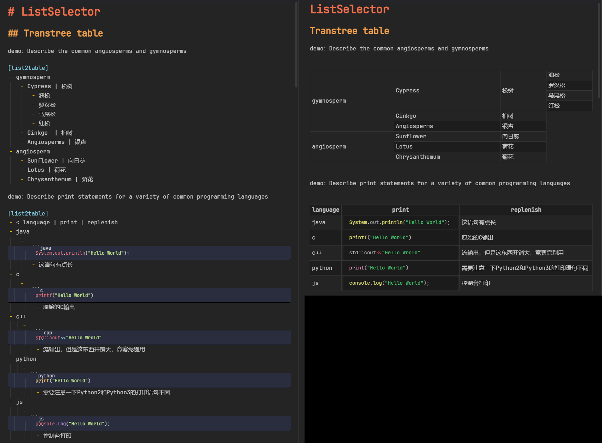
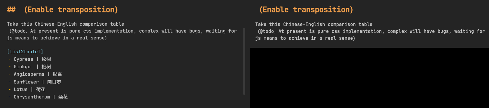
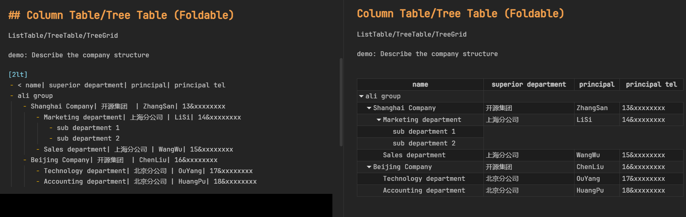
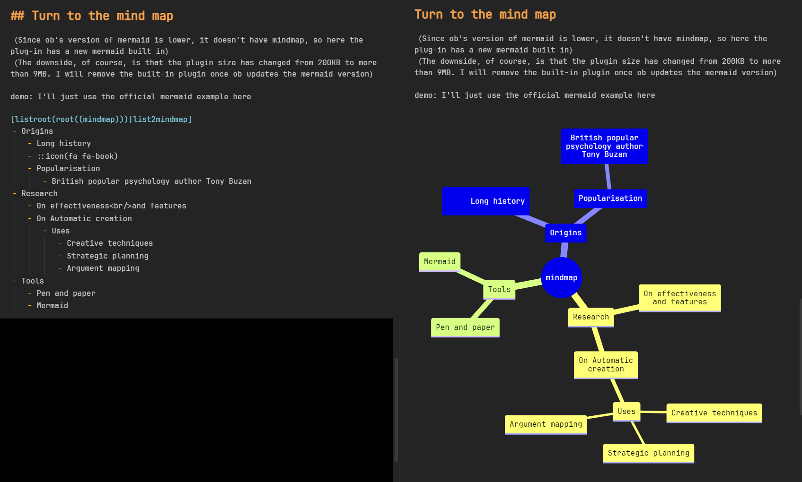
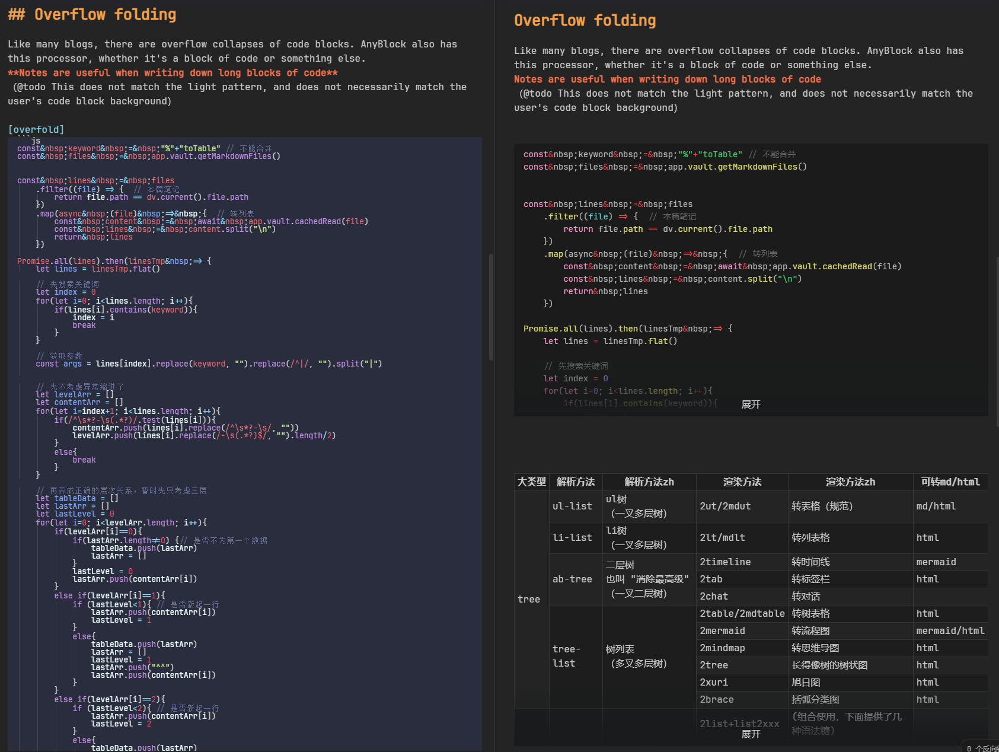
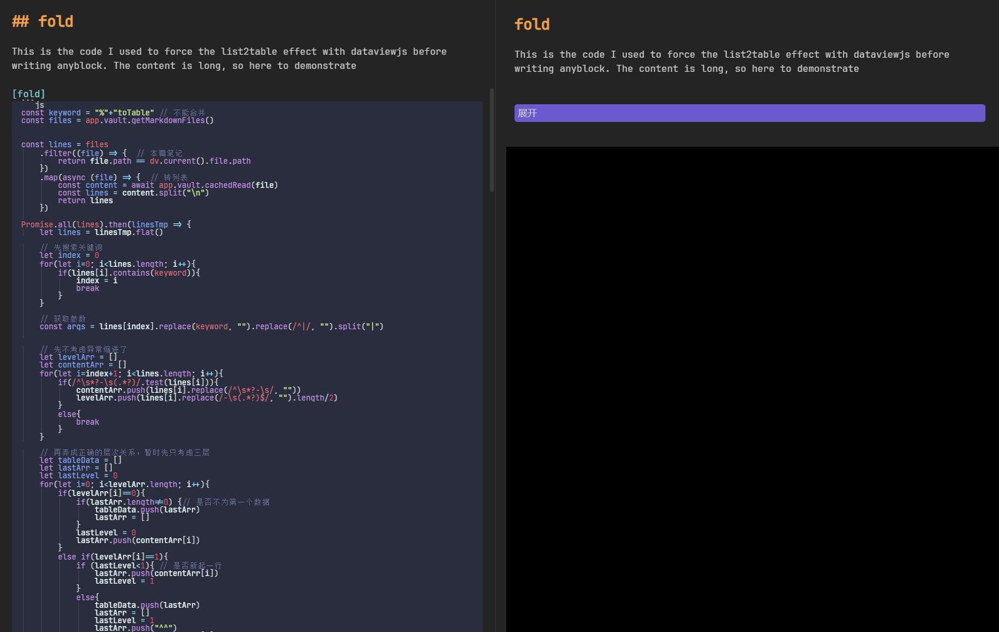
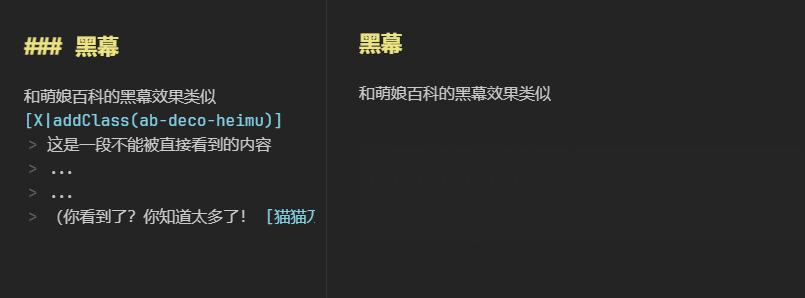

[Other Language（其他语言）](./docs/)

# obsidian-any-block

A Obsidian Plugin. You can flexibility to create a 'Block' by some means.
 
## Usage

Function：Block conversion、list to table or other tree graph，See the `demo` sample folder for details

[Usage Tutorial & Sample Library](./.)

## If bug

~~try to close `strict line wrapping`~~

## Suport command

Look the setup panel or [Usage Tutorial & Sample Library](./.)

Here are some of the more common processors:
- list2table  (2datatable)
- list2listtable
- list2mermaid  (graph LR)
- list2mindmap  (mermaid v9.3.0 mindmap)
- list2tab
- list2timeline
- title2list + list2somthing

## support

开发不易，赞助入口（可备注：OB插件support）

## Todo

**(Don't repet it in issue)**

- 首要TODO
	- 可视化编辑表格
	  （这三个点要依次渐进实现，实现前一个才能实现下一个）
		1. `| `增加下级项=>`\ `或`/ `或`& ` 增加同级项（能更好地压缩高度，也有主于ul表格的生成。开发难度：`|`和`\`混杂在一起不好处理）
		2. `表格项` 的接口需要扩展，加多一个接口项：来表明这个项是通过换行生成还是`|`或`\`，否则难以做到下面的问题
		3. 可视化编辑表格（实现难度：必须前解决上面的问题，否则反向编辑会有问题（会将内联块拆除掉了））
	- 其他
		- 增加处理器或选择器。例如：转置表格、QA处理器
- reinforce
	- 处理器
		- 优化2ultable，在这个模式中让内联换行变成同级换行而非下级换行的意思
	- 层级
		- 负级列表开关
		- 根据层级关系，推荐合理的处理器（如检测到树相关的就推荐树类处理器）
	- 样式
		- 树表格的间隔着色样式获取可以优化
		  方案1：例如多行的格可以视情况使用渐变（单数不用，复数需要，但会不会有不统一的问题）？
		  方案2：仿mindmap的着色，后面的列就不要隔行着色了
	- 转化
		- 右键选择转化为：md原生(表格)/html格式/图片
- fixing bug
	- **引用块内的列表/列表内的引用块 无法识别**
	- **表格转置与表头符号冲突、转置模式目前是纯css实现的 如果大家的行高不相同，会出现不匹配的情况。**
	  后续会将css实现改进为转化table元素实现

Reference、import

- [html-to-md](https://github.com/stonehank/html-to-md)
- [mermaid](https://github.com/mermaid-js/mermaid)

